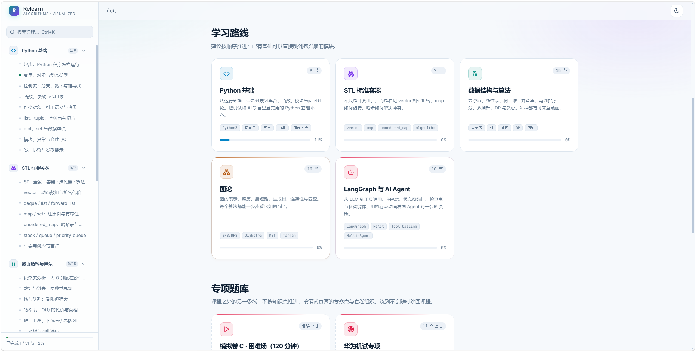
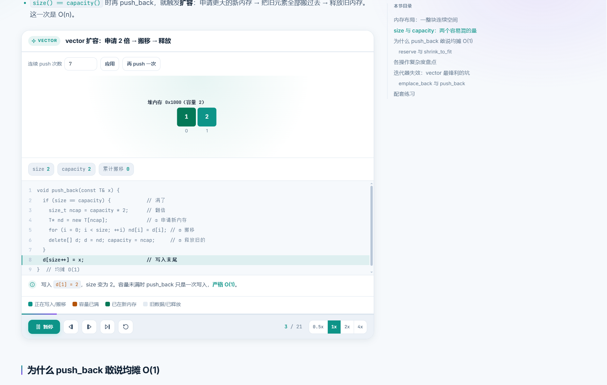
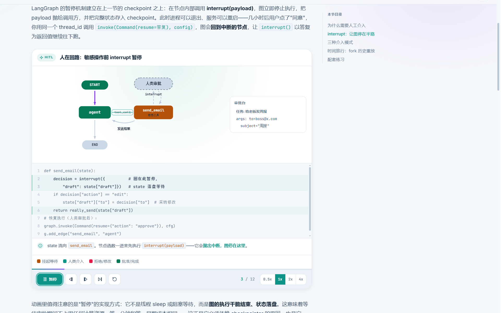

# Relearn · 算法与 AI Agent 可视化学习网站

一套**全中文**的系统化复健学习路线：Python 基础 → STL 容器 → 数据结构与算法 → 图论 → LangGraph 与 AI Agent。
每个抽象概念都配一个**可单步执行的动画**——先看见它怎么动，再理解它为什么这么写。

这是一个从 0 到 1 通过 vibe coding 完成的个人学习项目：需求拆解、内容补全、交互实现、题库 Python 化、校验与最终整理都围绕真实学习体验迭代完成。

## 首页展示



| STL vector 动画 | LangGraph 人在回路动画 |
|---|---|
|  |  |

## 快速开始

**方式一（推荐）**：双击 `启动网站.bat`，浏览器会自动打开 `http://localhost:8642`。

**方式二**：任何静态服务器均可，例如：

```bash
cd relearn
python -m http.server 8642
# 或
npx serve .
```

> 站点使用原生 ES Modules，直接双击 `index.html`（file:// 协议）会被浏览器的模块加载策略拦截，必须经 HTTP 访问。

## 内容结构

| 模块 | 节数 | 主题 |
|------|------|------|
| Python 基础 | 9 | 运行环境 · 变量对象 · 控制流 · 函数作用域 · 引用语义 · 序列切片 · dict/set · 模块异常文件 I/O · 类与类型提示 |
| STL 标准容器 | 7 | 全景 · vector · deque/list · map/set · unordered_map · 适配器 · algorithm |
| 数据结构与算法 | 15 | 复杂度 · 线性表 · 栈队列 · 哈希 · 堆 · 树 · BST · 并查集 · Trie · 排序 · 二分 · 双指针 · 递归回溯 · DP · 贪心 |
| 图论 | 10 | 图表示 · BFS · DFS · 拓扑 · Dijkstra · Bellman-Ford/Floyd · MST · Tarjan · 二分图 · 网络流 |
| LangGraph 与 AI Agent | 10 | Agent 概念 · Tool Calling · ReAct · 状态图 · 条件路由 · 检查点 · 人在回路 · 多智能体 · RAG · 综合实战 |

每节课末尾都有**配套练习**（共 142 项：力扣题 / 洛谷题 / AI 动手实验），带「练什么 → 思路提示 → 完成后对照」三段式。

### 专项题库（另一条线）

课程按知识点递进，题库按**考察点与套卷**组织，两者进度独立统计、互不干扰。

| 题库 | 内容 | 组织方式 |
|------|------|----------|
| 华为机试专项 | 1 份导读 + 7 份考察点专项 + 3 份限时模拟卷 | 按华为机试真实形态：ACM 模式手写 I/O、IOI 赛制按测试点给分、3 题 120 分钟 |

题库特有的功能：

- **Python 示例代码**：套卷示例统一为 Python 3，重点讲递归深度、银行家舍入、负数整除这些 Python 自己的坑

- **限时计时器**：模拟卷内置 120 分钟倒计时，可暂停 / 重置，剩 10 分钟变色
- **套卷构成表**：题号 / 考察点 / 分值 / 建议用时一览，标注通过线
- **考频与限时标注**：每题标「高频 / 常考 / 经典」与建议用时
- **知识点回链**：练到不会一键跳回对应课程节，形成「练 → 卡住 → 回看 → 再练」闭环
- **逐题攻克进度**：每题单独标记，进度存 `localStorage` 的独立字段，不污染课程的「已完成 N/51」

## 功能

- **逐帧动画**：播放 / 暂停 / 单步 / 回退 / 变速 / 进度拖动，全部可回溯
- **伪代码同步高亮**：动画走到哪行，代码亮到哪行
- **变量监视**：关键变量实时显示
- **可换输入**：大部分演示支持自定义数据
- **随堂自测**：答错给解释，不只判对错
- **进度记录**：`localStorage` 本地保存，标记完成自动跳下一节
- **全文搜索**：`Ctrl+K` 快速定位课程
- **深浅色主题**：跟随系统，可手动切换
- **键盘快捷键**：课程页 `j`/`k` 切换上下节；动画面板聚焦后空格播放、←→ 单步

## 技术说明

零构建、零依赖、纯静态：原生 HTML + CSS + ES Modules。
无需 Node.js 运行时、无需打包器；任何静态托管（GitHub Pages / 本地 HTTP 服务）即可部署。

```
relearn/
├─ index.html               # 唯一入口
├─ assets/css/              # 设计令牌 / 排版 / 动画面板样式
├─ assets/js/
│  ├─ app.js                # 路由 · 导航 · 进度 · 搜索
│  ├─ core/                 # 图标 / 高亮 / 渲染器 / 课程注册表 / 题库注册表 / 存储
│  ├─ viz/                  # 动画引擎 + 60+ 个演示
│  └─ content/              # 五大模块课程正文（数据文件）
│     └─ banks/             # 题库套卷（数据文件）
├─ tools/
│  ├─ validate.mjs          # 内容一致性校验
│  ├─ audit-bank.mjs        # 题库外链核实（力扣 API + 牛客 HTTP）
│  ├─ verify-lc.mjs         # 单查力扣题：题号 / 难度 / 中文题名 / 是否会员题
│  ├─ verify-nc.mjs         # 单查牛客题：HTTP 状态 + 题名
│  └─ extract-code.mjs      # 导出题库代码块供编译验证
└─ 启动网站.bat             # Windows 一键启动
```

路由：`#/` 首页 · `#/m/<模块>` 模块目录 · `#/l/<课程>` 课程页 · `#/b/<题库>` 题库总览 · `#/q/<套卷>` 套卷页

## 开发

新增课程 / 动画 / 题库套卷请阅读 `SPEC.md`（作者手册），改完跑：

```bash
node --check assets/js/content/xxx.js   # 语法
node tools/validate.mjs                 # 注册表 ↔ 内容 ↔ 动画 一致性（须 0 错 0 警）
node tools/audit-bank.mjs --check       # 题库全部外链逐个核实
```

浏览器打开 `/tools/viz-test.html` 可对全部动画做逐帧冒烟测试（挂载 + 快进所有帧 + 异常捕获）。

当前规模：**51 节课 · 55 种动画（65 处挂载）· 142 项配套练习 · 1 个专项题库（11 份套卷）· 全部通过一致性校验、外链核实与浏览器冒烟测试**。
